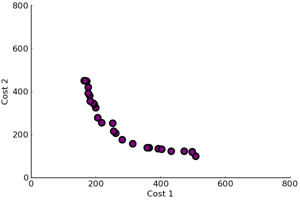

# PathOptimization

A Julia package for path optimization.

# Example
In the example below, ant colony optimization is used to find the Pareto frontier of a path with two objective cost functions. 
```@julia
using Revise, PathOptimization, Distributions, Random, Plots
using Fitness
Random.seed!(5214)
n_obj = 2
n_nodes = 25
cost = [rand(Uniform(0, 50), n_nodes, n_nodes) for _ in 1:n_obj]
iterations = 2000
method = AntColony(n_ants=100, n_nodes=n_nodes, β=4.0)
options = (parallel = true, progress = false)
result = optimize(method, cost, iterations; options...)

frontier = get_best_cost(result.frontier)
pyplot()
scatter(frontier, grid=false, leg=false, ylims=(0,800), xlims=(0,800),
    size=(600,400), markersize=9, markerstrokewidth=2, color=:purple, xlabel="Cost 1",
     ylabel="Cost 2", xaxis=font(12), yaxis=font(12))
```



# API

The package PathOptimizaiton.jl provides a lightweight API for adding new algorithms, which only requires two objects and four methods. Additional methods can be called from the four required methods. An example based on a random search strategy is used to illustrate the API. A minimal working example can be found in src/RandomSearch.jl and Examples/Random_Search_Example.jl.

## Objects

### PathFinder

Parameters of each algorithm are defined in a subtype of PathFinder. For example:

```@julia
struct RandomSearch <: PathFinder
    n_nodes::Int
    start_node::Int
    end_node::Int
end
```
n_nodes is the number of nodes in the graph, start_node and end_node are the starting and ending nodes, respectively.

### State

The state of each algorithm is tracked in a subtype of State. Here is a simple example:

```@julia
mutable struct RandomState{T} <: State
    n_obj::Int
    cost::Array{Array{Float64,2},1}
    frontier::T
    fitness::Array{Float64,1}
    path::Array{Int,1}
end
```
n_obj is the number of objective functions, each array in cost corresponds to the cost matrix of each objective, frontier manages the Pareto frontier, fitness is the cost of the solution for each objective, path is the current path.

## Methods


### initialize

The initialize function sets up the Pareto fronier, and other algorithmic specific configurations, and returns the state object.

```@julia
function initialize(method::RandomSearch, cost)
    # number of objective functions
    n_obj = length(cost)
    scheme = Scheme{n_obj}(0.1, is_minimizing=true)
    # object for managing Pareto frontier
    a = EpsBoxArchive(scheme)
    # initialize fitness 
    fitness = fill(0.0, n_obj)
    # initialize path
    path = fill(0, method.n_nodes)
    # initialize state object
    state = RandomState(n_obj, cost, a, fitness, path)
    return state
end
```

### find_paths!

A single threaded method that finds a path each iteration. A global RNG is passed by default to find_path!, which iteratively selects a random available vertex and computes the transition cost. 

```@julia
function find_paths!(method::RandomSearch, state, args...)
    find_path!(method, state)
end

find_path!(method::RandomSearch, state::RandomState) = find_path!(method, state, Random.GLOBAL_RNG)

function find_path!(method::RandomSearch, state::RandomState, rng)
    @unpack n_obj,fitness,path,cost = state
    @unpack n_nodes,start_node,end_node = method
    path[1],path[end] = start_node,end_node
    w = fill(1 / n_nodes, n_nodes)
    w[[start_node,end_node]] .= 0.0
    n0 = start_node
    for n in 2:(n_nodes - 1)
        obj_idx = rand(rng, 1:n_obj)
        n1 = sample(rng, 1:n_nodes, Weights(w))
        w[n1] = 0.0
        path[n] = n1
        map!(i -> fitness[i] += cost[i][n0,n1], fitness, 1:n_obj) 
        n0 = n1
    end
    map!(i -> fitness[i] += cost[i][n0,end_node], fitness, 1:n_obj) 
    return nothing
end
```

### pfind_paths!

An optional multithreaded method that finds a path on each iteration.

```@julia
pfind_paths!(method::RandomSearch, state, rngs)
```

### update!

A method for updating the algorithm and state after each iteration. update! stores the solutions using a genric method and resets the state for the next iteration. 

```@julia
function update!(method::RandomSearch, state)
    store_solutions!(method, state)
    reset_state!(state)
end

function reset_state!(state::RandomState)
    state.fitness .= 0.0
    state.path .= 0
end

# A generic method defined in AbstractMethods.jl
function store_solutions!(method::PathFinder, state)
    add_candidate!(state.frontier, Tuple(state.fitness), state.path, 2)
    return nothing
end

```